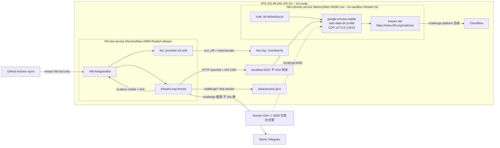
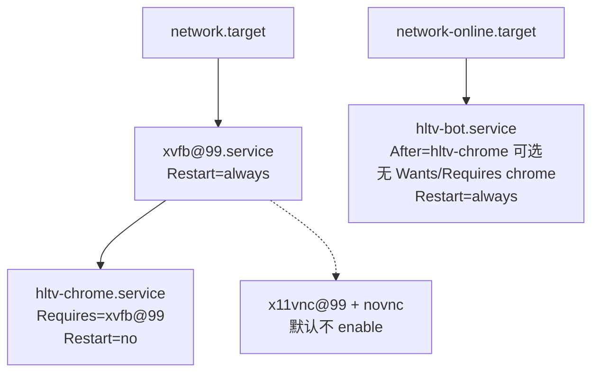

# Chrome keeper（第一步）：自动续 Cloudflare cookie，保住 xhr-poll

| 字段 | 值 |
|---|---|
| 状态 | Draft |
| 作者 | TBD |
| 日期 | 2026-09-17 |
| 修订 | 2026-09-17（评审：去掉 Wants=、挑战先判定再落盘、CDP 不覆盖 io、Chrome Restart=no） |
| 范围 | **仅 Step 1**：headed Chrome + Xvfb keeper tab → CDP 导出 cookie → Python 继续 `iter_scorebot` xhr-polling |
| 非范围 | Step 2 页内 WS 中继、MV3 extension、FlareSolverr、异地 keeper、Firefox/Camoufox、打码平台 |
| 相关文档 | `docs/chrome-gateway.md`、`docs/cloudflare.md`、`docs/scorebot-transport.md`、`docs/hltv-api.md`、`deploy/chrome-session/README.md`、`AGENTS.md` |

---

## Overview

hltv-bot 用 `curl_cffi` TLS impersonate + `data/session.json` 里烤好的 Cookie 过 Cloudflare，Scorebot 事件走 Engine.IO v3 **xhr-polling**。`__cf_bm` 大约 30 分钟级过期；今天只能人手 `/cookie` 或 CLI `import-cookie`。Python 自己对 `wss://scorebot-lb.hltv.org` 做 Upgrade 经常 403，因为 CF 验的是「是不是刚过完 JS 的那个真 Chrome 进程」（见 `docs/scorebot-transport.md`）。

**本设计只做 Step 1：** VPS 上常驻 1 个 headed Chrome（Xvfb `:99`），idle keeper tab 挂 `https://www.hltv.org/matches`，让页内自己打 `/cdn-cgi/challenge-platform/` 续 `__cf_bm`。Bot **只 attach** `http://127.0.0.1:9222`，用 CDP `Network.getAllCookies` 按现有 `format_cookie_header` 顺序 merge 进 `data/session.json`（`impersonate` / `user_agent` / `sec-ch-ua*` 不动）。首次 Turnstile 走 localhost VNC + SSH 隧道（**只转 6080**，9222 留在机器上）。之后 Chrome **`Restart=no`**，禁止 `Restart=always` / 周期性 on-failure 拉起。Python 采集路径不变。

目标机器：`191.96.243.105`，2G RAM、无 GPU、闲时 ~208M、Swap 0（运维加 1G swapfile，`swappiness=10`）。bot `MemoryMax=400M` 不动；Chrome `MemoryMax=900M` 是 **cgroup RAM 杀进程上限，不是 swap 气球**。RSS 目标 &lt;700M：keeper-only 过夜 `smem` 达标后才算 Step 1 完成。

---

## Background & Motivation

### 当前状态

- Cookie 入口：`HltvTelegramBot._apply_cookie` → `save_cookie` → `self.session = load_session(path)`（`hltv_bot/bot.py`）。**会换掉对象**，`iter_scorebot` 仍拿着旧引用。CLI：`python3 -m hltv_bot import-cookie`。
- 运行时轮换：Scorebot poll 的 `Set-Cookie` 只覆盖 `_ROTATE_COOKIE_KEYS = {io, _cfuvid, __cflb, cf_clearance, __cf_bm}`（`BrowserSession.update_cookie` / `_pairs_from_jar`）。`io` 来自 **handshake 响应**，不是 keeper tab。Optanon 等全量粘贴字段靠人手保留。
- `iter_scorebot` 在重连循环 **外** `headers = sess.as_headers()`（`hltv_bot/scorebot.py` 约 L551），handshake GET、`readyForMatch` POST、poll GET 共用这份拷贝。
- 部署：GitHub Actions rsync 到 `/opt/hltv-bot`，**已 exclude** `.env`、`data/session.json`、`data/chats.json`、`data/settings.json`，然后 **只** `systemctl restart hltv-bot`（`.github/workflows/deploy.yml`）。当前 `hltv-bot.service` 只有 `After=`/`Wants=network-online.target`。
- 现成 unit：`deploy/chrome-session/`。Chrome 以 **root + `--no-sandbox`** 跑（专用盒子，Chrome 拒绝 uid 0），`--disable-gpu`、CDP `127.0.0.1:9222`、`user-data-dir=/var/lib/hltv-chrome/profile`，**`Restart=no`**。
- `docs/chrome-gateway.md` 已评估并选定方案 A 分两步；用户确认「可以 规划实现」。本文是 **实现设计**，不再重开方案。
- `websocket-client>=1.9.2` 仅在 `pyproject.toml` 的 **dev extra**。VPS `uv sync` **不**带 `--all-groups`，升到 `[project].dependencies` 之前 import 会炸。`requirements.txt` 只有 curl_cffi / dotenv，**不是**部署真源。

### 痛点

1. `__cf_bm` ~30 min，人手烤 cookie 撑不住 24h poll。
2. 2G VPS 不能常驻「每次 launch 的 Playwright」，也不能把 Chrome 和 bot 绑成一个 unit（每次 push 都重启 bot）。
3. 现有 chrome-session README 仍写 Playwright `connect_over_cdp` 和 `Restart=always`，与已决架构冲突。

---

## Goals & Non-Goals

### Goals

1. 首次人手过 Turnstile 之后，**停人手 `/cookie`**，poll 仍能出 Kill（验收与 `docs/chrome-gateway.md` 一致）。**不**声称 watch 在已经 403 之后还能自己活过来。
2. Cookie 导出保留 `format_cookie_header` 顺序，不擦掉 Optanon / MatchFilter 等既有字段；不改 UA / impersonate；**不从 CDP 覆盖 `io`**。
3. Chrome 进程生命周期独立于 bot：`systemctl restart hltv-bot` 和 GitHub deploy **不得 start/restart/enable Chrome**。
4. 挑战页（title 含 `Just a moment`，**或原始 CDP jar 缺 `cf_clearance`**）→ **先判定、不 persist** → CDP 截图 + Telegram 告警管理员 → **等人手 VNC，禁止自动重启 Chrome**。
5. 本地开发无 Chrome 时 bot 仍能跑（CDP 连不上则跳过 keeper，继续手动 cookie）。
6. 给 Step 2 留口：CDP attach-only、单 keeper tab、Chrome 不跟 bot 重启、不 `Restart=always`。

### Non-Goals（明确不做）

- 页内 `new WebSocket` / match tab / ingest 中继（Step 2）。
- Python 对 scorebot 的 Upgrade 变稳（本步不解决 403 根因）。
- **403 之后自动重连 watch**（`CloudflareError` 仍结束 `_watch_loop`；热更新只覆盖 403 **之前**的 `__cf_bm` 轮换）。
- Playwright / Puppeteer 运行时依赖。
- MV3 extension、FlareSolverr、远程 keeper、Firefox/Camoufox、打码。
- 把 `session.json` 搬到 `/var/lib/hltv-bot/`。
- Python `subprocess` launch Chrome。
- 每 20 分钟 `Page.reload` keeper。
- `--disable-gpu` **和** `--disable-software-rasterizer` 同时开。
- `--headless` / Python launch Chrome。
- bot unit 上 `Wants=` / `Requires=` chrome（会在 `restart hltv-bot` 时把 Chrome 拉起来）。

---

## Key Decisions

硬决定（来自 `docs/chrome-gateway.md` + 本实现选型）。**不要在实现 PR 里重开。** 文末汇总表与此一致。

| # | 决定 | 实现落点 |
|---|---|---|
| 1 | 只 `--disable-gpu`，保留软件光栅 | `hltv-chrome.service` flags |
| 2 | idle tab，定时导出，不 reload | `KeeperLoop` 只读 title / cookies / 必要时截图 |
| 3 | `session.json` 仍在 `data/` 或 `HLTV_SESSION` | merge 写回 `BrowserSession.path` |
| 4 | root + `--no-sandbox`（Chrome 拒绝 uid 0） | `hltv-chrome.service` |
| 5 | Chrome **`Restart=no`**（禁止 `always` 和周期性 `on-failure`） | `hltv-chrome.service`；挂了只告 `cdp down` |
| 6 | VNC/noVNC 仅 localhost，首次过后关掉；SSH **只转 6080** | README；deploy **不** enable novnc |
| 7 | 现在只有 1 个 keeper tab | `ExecStart` 只带 matches URL；0 个 page 才 `PUT /json/new` |
| 8 | RSS &lt;700M 是目标；`MemoryMax=900M` 是杀进程上限 | 过夜 `smem` 后才算 Step 1 完成 |
| 9 | VPS 1G swapfile，`swappiness=10` | `deploy/chrome-session/README.md` |
| 10 | Xvfb 默认 `800x600x16`；回退 `1280x720x24` → `1920x1080x24` | `xvfb@.service` + `--window-size` |
| 11 | `--renderer-process-limit=2` | keeper-only；Step 2 仍够 1+1 |
| 12 | CDP overlay：UA 不动；**不写 `io`**；挑战 **先判定再不 persist** | `merge_cdp_cookies()` / `is_challenge()` |
| 13 | Cookie exporter 放 **bot 守护线程**，不单独 systemd | `start_keeper_thread()`；循环 `except` 不退出 |
| 14 | Python 只 attach `http://127.0.0.1:9222` | `hltv_bot/cdp.py` |
| 15 | `websocket-client` 进 **`[project].dependencies`** + 刷新 `uv.lock` | 禁止 Playwright；cdp 不用 curl_cffi |
| 16 | 新的管理员告警 **英文**；截图走 `_notify_admins_photo`（**不** `_reply_photo`） | 30s 删除只用于 `/matches` |
| 17 | `hltv-bot.service` **最多 `After=hltv-chrome.service`，禁止 `Wants=`/`Requires=`** | deploy 绝不 start/restart/enable chrome |
| 18 | 同一把 `BrowserSession.lock`；paste 的 save+拷字段+**必做 60s quiet** 在同一临界区 | `apply_paste`；`overlay_cdp` 锁内看 `cookie_quiet_until`，禁止再调 `apply_cookie_str` |
| 19 | poll GET **和** handshake GET 每次从 `sess` 拷 cookie | `_refresh_cookie_header`；必测 |
| 20 | `HLTV_CDP_URL` 未设置 → 默认 `http://127.0.0.1:9222`；显式 off 才关 | `bot_from_env` |

### 13 详述：exporter 放 bot 内，不单独 unit

候选：

| | 独立 `hltv-cookie.service` | **Bot 内守护线程（采用）** |
|---|---|---|
| `restart hltv-bot` 时导出是否中断 | 否 | 是，但只有数秒 |
| 额外 Python 解释器 | ~30–40M，2G 上不值得 | 0 |
| Telegram 告警 | 要再读 `.env` token，重复 bot 逻辑 | `_notify_admins` + **新** `_notify_admins_photo` |
| Chrome 重启 | 都不碰 | 都不碰 |
| 实现量 | 第二个 `__main__` + unit + MemoryMax | `bot.run()` 里 `start_keeper_thread()` |

`__cf_bm` ~30 min，deploy 重启 bot 远小于这个窗口。Bot 启动立刻 export 一次即可补上。Chrome 仍独立常驻。

约束：线程必须 **attach-only**、连不上 CDP 时 **不崩溃 bot**、未捕获异常 **log + 告警 + continue**、写 cookie 必须 **原地改同一个 `BrowserSession` 对象**（见热更新），因为 `iter_scorebot(self.session, …)` 持有该引用。

---

## Proposed Design

### 总览



### systemd 依赖（Chrome 不跟 bot 走）



- `hltv-bot.service`：**不要** `Wants=hltv-chrome.service`，**不要** `Requires=`。`Wants=` 会在每次 `systemctl restart hltv-bot`（deploy 和 bot `Restart=always` 崩溃拉起）时 **start 未在跑的 Chrome**——包括从未 enable、admin 刚 `stop`/`disable`、或人已经让它停住的情况。
- **最多** `After=hltv-chrome.service`：Chrome 已在同一笔 transaction 里时 bot 等它；Chrome inactive 时 bot 照样起，回退 `/cookie`。
- Enable Chrome **只**在一次性 bootstrap：`systemctl enable --now xvfb@99 hltv-chrome`。
- Deploy **只** `systemctl restart hltv-bot`。`daemon-reload` 可以。REMOTE 脚本 **不得**出现对 `hltv-chrome` / `xvfb@` 的 `start` / `restart` / `enable`。PR1 review 用 grep 卡死。
- x11vnc / novnc：**不要** `enable` 进 multi-user.target。首次和告警时手动 `start`，过完 `stop`。

### Keeper 循环（5 min + 启动立刻）

`__cf_bm` ~30 min，导出间隔 **300s**（`HLTV_CDP_EXPORT_EVERY`，下限 60s）。Bot 启动、从「CDP 断开」恢复、以及 **`PUT /json/new` 之后 title 仍空**，立刻/提前跑一轮。不要做 20 min reload。

**挑战判定在 persist 之前。** 同一条 WS：title → cookies → `is_challenge` → 仅非挑战才 `overlay_cdp` → 挑战则同连接截图。从 challenge 恢复时：**先 persist（healthy 支），再**发 `clearance restored`（`opt`，不是第三支 `else`，避免跳过 overlay）。

```mermaid
sequenceDiagram
  participant Bot as HltvTelegramBot
  participant K as KeeperLoop
  participant HTTP as GET :9222/json/list
  participant WS as page webSocketDebuggerUrl
  participant Tab as keeper page
  participant Lock as BrowserSession.lock
  participant Sess as session.json
  participant Tg as admin DM

  Bot->>K: start daemon thread (bot.run)
  loop every 300s and on start
    K->>HTTP: list pages
    alt no Chrome / connection refused
      K-->>K: log warning; skip (bot stays up)
    else no hltv.org page
      K->>HTTP: PUT /json/new?https://www.hltv.org/matches
      Note over K: sleep 2s best-effort；title 空则 15s 后再拍一次
    end
    K->>WS: connect origin=http://127.0.0.1:9222
    K->>Tab: Runtime.evaluate document.title
    K->>Tab: Network.getAllCookies
    Note over K: is_challenge(title, url, raw CDP names) 先于任何写
    alt challenge
      K->>Tab: Page.captureScreenshot 同连接
      K->>Tg: _notify_admins_photo + send_message（不 _reply_photo）
      Note over K: 不 persist、不 restart chrome
    else healthy
      K->>Lock: overlay_cdp（锁内：quiet 则跳过；读 sess.cookie；merge；写盘。禁止再调 apply_cookie_str）
      K->>Sess: persist merged CF cookies
    end
    opt 上一轮是 challenge 且本轮 healthy（transition）
      K->>Tg: one-shot "clearance restored"
      Note over K: 与 persist 同 tick，不是第三支 else
    end
    K->>WS: close
  end
```

外层循环：

```python
while not stop.is_set():
    try:
        tick_keeper(...)
    except CdpUnavailable:
        alert_cdp_down_throttled()
    except Exception:
        log.exception("keeper tick")
        alert_cdp_down_throttled()
    sleep(every or 15 if need_quick_retry else every)
```

未捕获异常 **不得**结束线程。`threading.Thread(..., daemon=True)` 即可随 bot 退出。

### 模块划分

| 模块 | 职责 |
|---|---|
| `hltv_bot/cdp.py` | 只负责连 `127.0.0.1:9222`：`/json/list`、`/json/version`、`/json/new`、JSON-RPC。无 Telegram、不写 session。一次 WS 内 title+cookies+可选截图。 |
| `hltv_bot/session.py` | `merge_cdp_cookies()`（**跳过 `io`**）、`is_challenge_cdp()`、`BrowserSession.lock`、`cookie_quiet_until`、`apply_paste()` / `overlay_cdp()`（不重入）、原子 `save_cookie`。 |
| `hltv_bot/keeper.py` | 循环、挑战先判定、告警节流、健康路径只调 `overlay_cdp`。 |
| `hltv_bot/bot.py` | `run()` 启动线程；`/status` CDP 行；`_apply_cookie` → `session.apply_paste`；`_notify_admins_photo`。 |
| `hltv_bot/scorebot.py` | handshake GET、poll GET、readyForMatch POST 都 `_refresh_cookie_header`。 |
| `hltv_bot/__main__.py` | CLI `export-cookies`（运维探测；`--write` 遇 challenge **拒绝写盘、exit 非 0**；写盘不是热更新）。 |

Python **不** `Popen` Chrome，**不** `systemctl`。健康动作只有：截图、告警、等待。

零 page 时用 Chrome 已有 HTTP `PUT /json/new?<url>` 在 **已运行的** 浏览器里开 keeper tab。若 CDP 都连不上，说明 Chrome 进程不在 → 只告警（`Restart=no`，等人 `systemctl start hltv-chrome` + VNC）。

---

## CDP 客户端

### 为何把 `websocket-client` 升到 runtime，不手写、不用 curl_cffi

- Python 3.11 **没有** stdlib WebSocket。`/json/list` 是 HTTP，但 `Network.getAllCookies` 必须走 DevTools WebSocket。
- 手写 RFC6455 必须处理 ping/pong、mask、分帧；Chrome 会发 ping。不值得。
- `curl_cffi` 已有 WS，但 `tests/test_gaps.py` 的 `test_curl_cffi_only_in_http_and_scorebot` 把 `curl_cffi` 锁在 `http.py` / `scorebot.py` / `profile.py`。localhost CDP 不该走 TLS impersonate。
- `websocket-client>=1.9.2` **只在** `[dependency-groups] dev`。PR2 **必须**挪到 `[project].dependencies` 并跑 `uv lock` 刷新 `uv.lock`。VPS `uv sync` 不装 dev extra。不要把 `requirements.txt` 当部署清单。
- **禁止** Playwright / Puppeteer。
- 连接必须带 Origin，CI 可锁源码字符串：

```python
websocket.create_connection(
    ws_url,
    origin="http://127.0.0.1:9222",
    timeout=timeout,
)
```

`tests/test_gaps.py` 或 `test_cdp_client.py` 断言 `hltv_bot/cdp.py` 含 `origin="http://127.0.0.1:9222"`。

### 连接步骤

Chrome 111+ 对非浏览器 CDP 客户端查 `Origin`。unit 必须加：

```
--remote-debugging-address=127.0.0.1
--remote-debugging-port=9222
--remote-allow-origins=*
```

`*` 的明确取舍：调试口 **只绑 127.0.0.1** 时，本机任意进程都能连无认证 CDP（本来就能读 `.env`）。**禁止**把 9222 SSH 转到笔记本——那样本机浏览器/扩展访问 `127.0.0.1:9222` 等于远程控 VPS Chrome。VNC 只转 **6080**。`export-cookies` 在 SSH 会话里跑（`curl` / `uv run` 都在箱子上）。

1. `GET http://127.0.0.1:9222/json/list`（超时 3s）。
2. 选 `type=="page"` 且 URL 含 `hltv.org` 的 tab；优先 path 含 `/matches`。忽略 `devtools://`、`chrome-extension://`、iframe target。
3. 若没有任何 `hltv.org` page：`PUT http://127.0.0.1:9222/json/new?https://www.hltv.org/matches`，sleep **2s（best-effort）**，再 list。title 空 / 不像 matches：本轮不 persist，**15s** 后再拍（不是干等到 300s）。Chrome 进程不在 → **不要** new，返回 `CdpUnavailable`。
4. 连该 tab 的 `webSocketDebuggerUrl`（带 origin）。
5. **同一条 WS**：`Runtime.evaluate` → `Network.getAllCookies` → 若 `is_challenge` 再 `Page.captureScreenshot`。不要为截图重开连接。JSON-RPC `id` 单调递增，忽略事件帧。

### 使用的 CDP 方法

| 方法 | 用途 |
|---|---|
| （HTTP）`GET /json/list` | 发现 keeper tab |
| （HTTP）`PUT /json/new?url` | 仅 0 个 hltv page 时开 keeper |
| `Runtime.evaluate` | `document.title` |
| `Network.getAllCookies` | 含 HttpOnly `cf_clearance` / `__cf_bm` |
| `Page.captureScreenshot` | 仅挑战时，同连接 |
| `Target.getTargets` | 备用：`/json/list` 空时走 `/json/version` 的 browser websocket |

不调用 `Page.reload`、`Page.navigate`（除 `/json/new`）、`Network.setCookie`、`Browser.close`。

```python
# hltv_bot/cdp.py
DEFAULT_CDP = "http://127.0.0.1:9222"
KEEPER_URL = "https://www.hltv.org/matches"

class CdpUnavailable(Exception): ...
class CdpError(Exception): ...

@dataclass
class CdpSnapshot:
    title: str
    url: str
    cookies: list[dict]          # raw CDP cookie dicts
    screenshot_png: bytes | None
    created_new_tab: bool = False

def fetch_keeper_snapshot(
    base: str = DEFAULT_CDP,
    *,
    keeper_url: str = KEEPER_URL,
    timeout: float = 5.0,
) -> CdpSnapshot:
    """Attach only. Never launch Chrome.

    One WS: title + getAllCookies; screenshot only if
    is_challenge_cdp(title, url, cookies). May PUT /json/new if no hltv page.
    """
```

调用方 **不要**传 `want_screenshot=True` 无脑截。判定在 `cdp.py` 内或返回后立刻做，截图仍用同一 WS——实现上把 `is_challenge_cdp` 放 `session.py`（无 I/O），`fetch_keeper_snapshot` import 它，避免两次 round-trip。

---

## Cookie merge 算法

**不**走 `_pairs_from_jar`（只 rotate 五个键，且会从 jar 写入 `io`）。**不**整表替换 session cookie。

UA / impersonate / `sec-ch-ua*` **不**从 Linux Chrome 回写。

### 挑战判定（raw CDP，不是 merge 后的 header）

Overlay **从不删键**。Turnstile 页的 jar 可能根本没有 `cf_clearance`（或只有过期行，算法会 skip）。若用 merge 后再 `has_clearance()`，旧 clearance 仍在，准则 2 永不亮，只剩下 title 正则——本地化/空 title 会漏，并继续把「看起来还行」的旧 cookie 当活的。

```python
_CHALLENGE_TITLE = re.compile(r"just a moment", re.I)
_CDP_SKIP_NAMES = frozenset({"io"})  # Engine.IO sid：只来自 poll Set-Cookie
_CDP_CLEARANCE_KEYS = ("cf_clearance",)

def cdp_hltv_names(cdp_cookies: list[dict], *, now: float | None = None) -> set[str]:
    now = time.time() if now is None else now
    names: set[str] = set()
    for c in cdp_cookies:
        if not _cdp_usable(c, now):
            continue
        names.add(str(c["name"]))
    return names

def is_challenge_cdp(title: str, url: str, cdp_cookies: list[dict], *, now: float | None = None) -> bool:
    if _CHALLENGE_TITLE.search(title or ""):
        return True
    if "challenges.cloudflare.com" in (url or "").lower():
        return True
    names = cdp_hltv_names(cdp_cookies, now=now)
    if "cf_clearance" not in names:
        return True
    return False
```

「CDP 里 `__cf_bm` / `cf_clearance` 已过期」视为 **缺席**（`_cdp_usable` 为假），因此也会 `is_challenge_cdp`。过期行 **不** overlay，也 **不**用过期行把旧好值留下当「还活着」的信号。

挑战为真 → **不调用** `merge_cdp_cookies` / `apply_cookie_str` / `save_cookie`。只截图 + 告警。

### Overlay 允许的名字

从 CDP 写入的键：

- 始终允许的 CF 键：`__cf_bm`、`cf_clearance`、`_cfuvid`、`__cflb`
- 以及 **已经出现在 existing header 里**、且不是 `io` 的其它 hltv 域名字（OptanonConsent、MatchFilter、…）
- **永不**从 CDP 写 `io`（keeper tab 不是这场 scorebot 会话；browser-wide jar 里的 `scorebot-lb.hltv.org` `io` 会污染 in-flight poll 的 Cookie，与 query `sid` 不一致）

`update_cookie` / handshake `Set-Cookie` 仍可轮换 `io`——那是 poll 响应，不是 CDP。

### partitionKey

Chrome 可能返回同名、不同 `partitionKey`（CHIPS）的多行。Step 1：

- **丢弃** `partitionKey` 为非空 dict/字符串的行（只要 top-level / unpartitioned CF cookie）。
- 同名多 domain：按 `len(domain)` 升序 overlay（更具体的后写）。
- 测试：两条 `cf_clearance`，一条带 `partitionKey`，采用无 partition 的那条。

### 伪代码

```python
_CDP_CF_KEYS = frozenset({"__cf_bm", "cf_clearance", "_cfuvid", "__cflb"})

def _cdp_domain_ok(domain: str) -> bool:
    host = (domain or "").lower()
    d = host.lstrip(".")
    return d == "hltv.org" or d.endswith(".hltv.org") or host.endswith(".hltv.org")

def _partitioned(c: dict) -> bool:
    pk = c.get("partitionKey")
    if pk in (None, "", {}, []):
        return False
    return True

def _cdp_usable(c: dict, now: float) -> bool:
    name = str(c.get("name") or "")
    if not name or name in _CDP_SKIP_NAMES:
        return False
    if _partitioned(c) or not _cdp_domain_ok(str(c.get("domain") or "")):
        return False
    if not _cookie_value_ok(str(c.get("value") or "")):
        return False
    if _cdp_expired(c, now):
        return False
    return True

def merge_cdp_cookies(
    existing_cookie_header: str,
    cdp_cookies: list[dict],
    *,
    now: float | None = None,
) -> str:
    now = time.time() if now is None else now
    pairs = _pairs_from_cookie_str(existing_cookie_header)
    existing_names = set(pairs)
    relevant = [c for c in cdp_cookies if _cdp_usable(c, now)]
    relevant.sort(key=lambda c: len(str(c.get("domain") or "")))
    for c in relevant:
        name = str(c["name"])
        if name in _CDP_CF_KEYS or name in existing_names:
            if name == "io":
                continue
            pairs[name] = str(c["value"]).strip()
    return format_cookie_header(pairs)
```

空 jar / 全过期 / 全被 skip：返回现有 header，不写成空串。挑战路径根本不会走到这里。

### 锁、原子写、`/cookie`

`threading.Lock` **不可重入**。所有读改写必须在 **一把** `BrowserSession.lock` 里完成；`overlay_cdp` **禁止**再调会自己 `with self.lock` 的 `apply_cookie_str`。

`BrowserSession` 字段：`lock`、`cookie_quiet_until: float = 0.0`（单调时钟）。`COOKIE_QUIET_AFTER_PASTE = 60.0` 是 **必做**，不是可选。quiet 挂在 **session** 上，不要挂在 bot 解锁之后。

同一把锁覆盖：

1. 内存 `cookie` + `headers["cookie"]`（及 paste 时的 impersonate/UA 字段）
2. 磁盘 `save_cookie`（同目录 tmp + `os.replace`）
3. merge / paste 都读 **锁内的** 当前状态
4. `cookie_quiet_until` 的读与写

`os.replace` 只保证单次 JSON 写原子，**不能**单独保证 paste 与 overlay 的 RMW。必须靠这把锁。

```python
COOKIE_QUIET_AFTER_PASTE = 60.0  # required

def _apply_cookie_str_unlocked(self, cookie: str) -> bool:
    new = format_cookie_header(_pairs_from_cookie_str(cookie))
    if new == self.cookie:
        return False
    self.cookie = new
    if "cookie" in self.headers:
        self.headers["cookie"] = new
    if self.path:
        save_cookie(self.path, new)
    return True

def apply_cookie_str(self, cookie: str) -> bool:
    with self.lock:
        return self._apply_cookie_str_unlocked(cookie)

def overlay_cdp(self, cdp_cookies: list[dict]) -> bool:
    """Keeper healthy path only. Caller already ran is_challenge_cdp == False."""
    with self.lock:
        if time.monotonic() < self.cookie_quiet_until:
            return False  # paste 静默窗：可告警，不 overlay
        merged = merge_cdp_cookies(self.cookie, cdp_cookies)
        return self._apply_cookie_str_unlocked(merged)  # 不要调 apply_cookie_str

def apply_paste(self, raw: str) -> None:
    """/cookie 唯一写路径：save + 原地拷字段 + quiet，一个临界区。"""
    if not self.path:
        raise ValueError("session path required")
    with self.lock:
        save_cookie(self.path, raw)
        fresh = load_session(self.path)
        self.impersonate = fresh.impersonate
        self.headers = fresh.headers
        self.cookie = fresh.cookie
        self.path = fresh.path
        self.cookie_quiet_until = time.monotonic() + COOKIE_QUIET_AFTER_PASTE
```

`/cookie` → `self.session.apply_paste(raw)`。**禁止** 锁外 `save_cookie` 再 load。**禁止** `self.session = load_session(...)`。不要 `_reload_session_inplace` 这种「先 save 再进锁 load」的拆分。

交错：

- paste 先拿到锁：盘+内存已是 paste，quiet=now+60；随后 overlay 在锁内看到 quiet，跳过。paste 赢。
- overlay 先拿到锁：先写出健康 CDP merge；随后 paste 拿到锁，`save_cookie(paste)` + 拷字段 + quiet，覆盖 overlay。paste 赢。
- 旧错序（save 在锁外 → overlay 用过期内存 replace 盘 → load 看到 overlay）不允许出现。

`id(self.session)` 在 `/cookie` 前后不变。

### 例子

**现有 session.json cookie：**

```
io=live; _cfuvid=uvid1; __cflb=lb1; cf_clearance=oldcf; __cf_bm=oldbm; OptanonConsent=datestamp=x; MatchFilter=keep
```

**CDP 本轮（健康页）：**

| name | value | domain | 处理 |
|---|---|---|---|
| `cf_clearance` | `newcf` | `.hltv.org` | overlay |
| `__cf_bm` | `newbm` | `.hltv.org` | overlay |
| `io` | `sid9` | `scorebot-lb.hltv.org` | **跳过** |
| `OptanonConsent` | `datestamp=y` | `.hltv.org` | overlay（已在 header） |
| `NID` | `xyz` | `.google.com` | 丢（域名） |
| `__cflb` | `bad\n` | `.hltv.org` | 丢（CRLF），保留 `lb1` |
| `cf_clearance` | `part` | `.hltv.org` + `partitionKey` | 丢 |

**结果：**

```
io=live; _cfuvid=uvid1; __cflb=lb1; cf_clearance=newcf; __cf_bm=newbm; OptanonConsent=datestamp=y; MatchFilter=keep
```

**挑战例：** title=`Just a moment...`，CDP 无 `cf_clearance`（或只有过期行），existing 仍有 `cf_clearance=oldcf` → `is_challenge_cdp` True → **文件与内存仍是 oldcf**，不 overlay 挑战 jar 的 `__cf_bm`。

---

## Bot 热更新 cookie（403 之前；不换对象）

### 现状问题

1. `_apply_cookie` 做 `self.session = load_session(path)`，**换了对象**。
2. `iter_scorebot`：`headers = sess.as_headers()` 在 `while True:` **外面**（约 L551）。三处 HTTP 共用拷贝：
   - handshake `client.get(url, headers=headers)`（约 L572）
   - `readyForMatch` `client.post(..., headers=post_headers)`（约 L425，`post_headers = dict(headers)` 一次）
   - poll `client.get(..., headers=headers)`（约 L466）
3. `CloudflareError` 从 `iter_scorebot` 再抛；`_watch_loop` `_mark_watch_down` + 中文「Cookie 已失效」，**不重连**。热更新 **不能**让已经 403 的 watch 复活。

### 要改的

**A. 原地更新（见上锁一节）。** `/cookie` 只调 `session.apply_paste`（save+拷字段+60s quiet 同一临界区）。Keeper 健康路径只调 `session.overlay_cdp`（锁内检查 quiet，不调 `apply_cookie_str`）。都不得 `self.session = ...`。

**B. 每次 HTTP 刷新 Cookie 头**

`headers = sess.as_headers()` **移进** `while True:` 重连循环（每次 handshake 整表刷新）。循环内每一次 `client.get` / `client.post` 再走：

```python
def _refresh_cookie_header(headers: dict[str, str], sess: BrowserSession | None) -> dict[str, str]:
    if sess is None:
        return headers
    cookie = sess.as_headers().get("cookie")
    if cookie:
        headers = dict(headers)
        headers["cookie"] = cookie
    return headers
```

必须刷新的调用（`hltv_bot/scorebot.py` 仅此三处）：

| 调用 | 函数 | 刷新 |
|---|---|---|
| handshake GET | `iter_scorebot` | 进 reconnect 循环时 `as_headers()` + 每次 GET 前 `_refresh_cookie_header` |
| readyForMatch POST | `iter_poll_events` | POST 前 refresh（低风险但同一函数处理） |
| poll GET | `iter_poll_events` 循环 | **每一次** GET 前 refresh |

`try_open_ws` 的 Cookie 来自 handshake 当时的 merge；Step 1 仍以 poll 为主，WS 403 熔断不变。不在本步为 WS 再做一套热更新。

Keeper 写入后，**下一发 poll GET**（通常 ≤ `POLL_MIN_GAP` 5s）带上新 `__cf_bm`，**不必** `/stop`。Engine.IO `sid` 与内存里的 `io` 仍有效（CDP 不碰 `io`）。

**C. 403 边界（写进实现注释和 PR3 描述）**

热更新只防止 `__cf_bm` 过期导致的 **下一次** 403。一旦 poll/handshake 已经 `CloudflareError`，watch 进 DEBUG，等管理员 `/watch`（或 cookie 恢复后人手再 watch）。**不要**写「不必 /stop 也能从 403 恢复」。实现 reconnect-after-refresh **本步不做**。

**D. 不做文件 mtime watch。**

---

## 挑战检测与告警

判定（`is_challenge_cdp`，见 merge 节）：

1. `document.title` 匹配 `(?i)just a moment`
2. **原始 CDP** hltv 域可用名字里没有 `cf_clearance`（过期/partitioned 算没有）
3. page URL 含 `challenges.cloudflare.com`

**不要**用 merge 后的 `BrowserSession.has_clearance()`。

动作：

1. 同 WS `Page.captureScreenshot`
2. **`_notify_admins_photo`**：直接 `self.tg.send_photo(admin_id, png, caption=..., filename="cf-challenge.png")`。**禁止** `self._reply_photo`（它会 `_schedule_delete`，`MSG_TTL` 30s，和 `/matches` 一样）。AGENTS.md 的免删只覆盖 `/watch` 卡片，不管 admin 图。
3. 另发 `_notify_admins` 英文 HTML（caption 1024 截断，正文可更长）
4. **不** persist、**不** `systemctl`、**不** `Page.reload`
5. 节流：首次立刻；恢复前每 **1800s** 最多再告一次（`ADMIN_CHALLENGE_EVERY = 1800`）
6. 恢复：一次性 `HLTV Chrome keeper: clearance restored`
7. CDP 连续失败：`cdp down` 文案（Chrome `Restart=no`，要人 `systemctl start` + VNC）

```python
def _notify_admins_photo(self, photo_bytes: bytes, *, caption: str, filename: str = "cf-challenge.png") -> None:
    for aid in sorted(self.admin_ids):
        try:
            self.tg.send_photo(aid, photo_bytes, caption=caption[:1024], filename=filename)
        except Exception:
            log.exception("notify admin photo %s", aid)
```

不进授权群、不 auto-delete。FakeTg 测试必须实现 `send_photo`，并断言 challenge 消息 **不**进 `deleted`。

告警文案（英文）：

```
<b>HLTV Chrome keeper: challenge</b>
title=<code>Just a moment...</code>
cf_clearance=NO
tab=<code>https://www.hltv.org/matches</code>
Do not restart Chrome. SSH tunnel noVNC, pass Turnstile, then wait for next export.
ssh -L 6080:127.0.0.1:6080 root@191.96.243.105
```

注意：隧道 **只有 6080**，没有 9222。

`/status` 增加行（管理员）：

```
cdp        up 9222 / down
keeper     title=Matches | Just a moment...
exported   12s ago
clearance  yes|NO
```

---

## systemd / Chrome flags

### `deploy/chrome-session/xvfb@.service`

```
ExecStart=/usr/bin/Xvfb :%i -screen 0 800x600x16 -nolisten tcp
Restart=always
RestartSec=2
```

Xvfb 无 clearance 状态，`Restart=always` 可以。不要随便 restart xvfb（DISPLAY 没了 Chrome 会挂，而 Chrome 是 `Restart=no`）。

回退（人手改 unit + **维护窗口** `systemctl start` Chrome + VNC——因为 Restart=no，restart 等于一次维护）：

1. 默认：`800x600x16`，`--window-size=800,600`
2. Turnstile 白板：`1280x720x24` + `--window-size=1280,720`
3. 仍不行：`1920x1080x24` + `--window-size=1920,1080`

### `deploy/chrome-session/hltv-chrome.service`

```
[Unit]
Description=Persistent Google Chrome for HLTV (CDP 9222)
After=xvfb@99.service
Requires=xvfb@99.service

[Service]
# root VPS: Chrome needs --no-sandbox (refuses uid 0)
Environment=DISPLAY=:99
Environment=HOME=/var/lib/hltv-chrome
MemoryMax=900M
# 不设 MemorySwapMax：允许 cgroup 把冷页换到主机 swap。
# MemoryMax 仍是 RAM 上限；热工作集 >900M 一样 SIGKILL。
ExecStart=/usr/bin/google-chrome-stable \
  --user-data-dir=/var/lib/hltv-chrome/profile \
  --remote-debugging-address=127.0.0.1 \
  --remote-debugging-port=9222 \
  --remote-allow-origins=* \
  --no-first-run \
  --no-default-browser-check \
  --disable-dev-shm-usage \
  --disable-gpu \
  --disable-extensions \
  --renderer-process-limit=2 \
  --disk-cache-size=67108864 \
  --window-size=800,600 \
  https://www.hltv.org/matches
Restart=no

[Install]
WantedBy=multi-user.target
```

**禁止：** `--disable-software-rasterizer`、`Restart=always`、`Restart=on-failure`（Step 1）、`--headless*`、`--remote-debugging-address=0.0.0.0`。root 必须 `--no-sandbox`。

`Restart=no`：进程退出（含 `MemoryMax` SIGKILL）就停住。bot 告 `cdp down`。任何再次 `start`/`restart` 都是维护事件，需要 VNC。不采用 `StartLimitBurst=2` / 300s：慢 OOM（每 6–10 分钟杀一次）会重置计数器，等于变相 `always`。

（若将来非要安全网：`Restart=on-failure` + `StartLimitIntervalSec=86400` + `StartLimitBurst=1`，且文档写明「systemd 拉起 = 维护/再 VNC」。Step 1 **不采用**，以免实现时又绕回循环。）

`MemoryMax=900M`：cgroup `memory.max`（RAM）。主机 1G swap **不能**让该 cgroup 超过 900M RAM。热 Turnstile 工作集 >900M → SIGKILL。Swap 只帮助冷页回收、以及 **cgroup 外**的系统。不要把 MemoryMax 当气球去「靠 swap 吃峰值」。RSS 常年 850M 时先降分辨率，再考虑加 MemoryMax。

### `deploy/hltv-bot.service`

保持现有：

```
After=network-online.target
Wants=network-online.target
```

**可选**增加 `After=hltv-chrome.service`（无 Wants）。**禁止** `Wants=hltv-chrome.service`。

`MemoryMax=400M`、`Restart=always`、root+uv **不动**。

### VNC units

`x11vnc@.service` 已是 `-localhost`。`novnc.service` 已绑 `127.0.0.1:6080`。不要 `enable --now`。需要时 `systemctl start x11vnc@99 novnc`，用完 `stop`。

---

## 环境变量

`.env.example`：

```
HLTV_CDP_URL=http://127.0.0.1:9222
HLTV_CDP_EXPORT_EVERY=300
HLTV_KEEPER_URL=https://www.hltv.org/matches
```

解析：

```python
def cdp_url_from_env(raw: str | None) -> str | None:
    """Unset → default attach URL. Explicit off → None (no keeper thread)."""
    if raw is None:
        return "http://127.0.0.1:9222"
    text = raw.strip()
    if text.lower() in {"", "0", "off", "disable", "false", "no"}:
        return None
    return text
```

- **未设置** `HLTV_CDP_URL`：默认开启 attach；连不上就 skip（本地无 Chrome 仍能跑）。
- **显式**空 / `off` / `0` / `disable` / `false` / `no`：不启动线程。
- 其它字符串：当 URL 用。

`bot_from_env` 读这些。无新 Telegram 权限。

---

## Deploy / rsync

现有 exclude 已足够（`data/session.json`、profile 不在源树）。

REMOTE 脚本：

```bash
install -m 644 deploy/hltv-bot.service /etc/systemd/system/hltv-bot.service
install -m 644 deploy/chrome-session/hltv-chrome.service /etc/systemd/system/hltv-chrome.service
install -m 644 deploy/chrome-session/xvfb@.service /etc/systemd/system/xvfb@.service
install -m 644 deploy/chrome-session/x11vnc@.service /etc/systemd/system/x11vnc@.service
install -m 644 deploy/chrome-session/novnc.service /etc/systemd/system/novnc.service
systemctl daemon-reload
systemctl enable hltv-bot
# 禁止：systemctl enable/start/restart hltv-chrome xvfb@99
systemctl restart hltv-bot
systemctl is-active hltv-bot
```

PR1 给 deploy 或文档加一条 **review 检查**：REMOTE 不得匹配 `systemctl (enable|start|restart) .*(hltv-chrome|xvfb@)`。

Chrome flags 变更必须维护窗口：人 `systemctl start`/`restart hltv-chrome` + VNC。

---

## VPS bootstrap（写进 `deploy/chrome-session/README.md`）

一次性 root，不进 GitHub Actions。

```bash
# --- 1G swap ---
if ! swapon --show | grep -q /swapfile; then
  fallocate -l 1G /swapfile || dd if=/dev/zero of=/swapfile bs=1M count=1024
  chmod 600 /swapfile
  mkswap /swapfile
  swapon /swapfile
  grep -q /swapfile /etc/fstab || echo '/swapfile none swap sw 0 0' >> /etc/fstab
fi
sysctl -w vm.swappiness=10
echo 'vm.swappiness=10' > /etc/sysctl.d/99-hltv-swappiness.conf

apt-get update
apt-get install -y google-chrome-stable xvfb x11vnc novnc websockify smem

id hltv >/dev/null 2>&1 || useradd --system --home /var/lib/hltv-chrome --create-home --shell /usr/sbin/nologin hltv
mkdir -p /var/lib/hltv-chrome/profile
chown -R hltv:hltv /var/lib/hltv-chrome

install -m 644 /opt/hltv-bot/deploy/chrome-session/*.service /etc/systemd/system/
systemctl daemon-reload
systemctl enable --now xvfb@99 hltv-chrome
systemctl start x11vnc@99 novnc
```

本机（**只转 6080**）：

```bash
ssh -L 6080:127.0.0.1:6080 root@191.96.243.105
# http://127.0.0.1:6080/vnc.html 过 Turnstile
# 9222 留在箱子上：
ssh root@191.96.243.105 'curl -sS http://127.0.0.1:9222/json/list'
```

过完：`systemctl stop novnc x11vnc@99`。不要 disable xvfb/chrome。

验收：

```bash
curl -sS http://127.0.0.1:9222/json/list
ss -lntp | grep -E '9222|5900|6080'   # 不得听 0.0.0.0
smem -u hltv -k
# Step 1 完成标准：keeper-only 过夜 RSS <700M，再开 keeper 线程
```

内存账：系统 ~208M + bot ≤400M + Chrome 目标 550–700M（**杀进程线** 900M）+ Xvfb ~15–40M ≈ 1.2–1.6G。1G swap 给系统/冷页，不给 Chrome 突破 MemoryMax。

---

## API / Interface Changes

对外 Telegram 命令不变。`/cookie` 仍是回退。`/status` 多几行 CDP。

```python
# session.py
def is_challenge_cdp(title: str, url: str, cdp_cookies: list[dict], *, now: float | None = None) -> bool: ...
def merge_cdp_cookies(existing_cookie_header: str, cdp_cookies: list[dict], *, now: float | None = None) -> str: ...
class BrowserSession:
    lock: threading.Lock
    cookie_quiet_until: float  # monotonic; 0 = not quiet
    def overlay_cdp(self, cdp_cookies: list[dict]) -> bool: ...
    def apply_paste(self, raw: str) -> None: ...
    def apply_cookie_str(self, cookie: str) -> bool: ...  # 自持锁；overlay_cdp 不得调用


# cdp.py
def fetch_keeper_snapshot(...) -> CdpSnapshot: ...

# keeper.py
CDP_EXPORT_EVERY = 300.0
ADMIN_CHALLENGE_EVERY = 1800.0
COOKIE_QUIET_AFTER_PASTE = 60.0
def start_keeper_thread(...) -> threading.Thread | None: ...
```

CLI：`python3 -m hltv_bot export-cookies` 打印 title / names / clearance。

- **无 `--write`**：只打印，exit 0（即使 challenge，方便 SSH 看 title）。
- **`--write`**：必须先 `is_challenge_cdp(snap.title, snap.url, snap.cookies)`。若 True：把 title/names 打到 stderr，**不** `save_cookie` / `merge`，**exit 非 0**。若 False：`merge_cdp_cookies` 后写 `HLTV_SESSION`（UA 不动）。
- **写盘不是热更新**：PR2 阶段若 bot 已在跑，`iter_scorebot` 仍拿旧对象/旧 headers 拷贝，直到 PR3。`--help` 同时写明「challenge 时 --write 拒绝」。

---

## Data Model Changes

`session.json` schema **不变**。`save_cookie` 改为 tmp+`os.replace`，字段语义不变。无 migration。

Chrome profile：`/var/lib/hltv-chrome/profile`。不要定期清。截图不落盘。

---

## 测试

现有闸会扩到新文件（PR3 改 `AGENTS.md`）。不需要真 Chrome。

### `tests/test_cdp_cookies.py`（PR2，必做）

- 健康 merge 例：保留 Optanon/MatchFilter/`io=live`；丢 NID、CRLF、`partitionKey`；顺序 `format_cookie_header`。
- CDP `io=sid9` **不得**覆盖 `io=live`。
- 过期 CDP 行不覆盖好值；过期 clearance 使 `is_challenge_cdp` 为真。
- session cookie `expires=-1` 仍可用。
- 空列表 → header 不变。
- `save_cookie` 不改 impersonate/UA/sec-ch-ua；原子 replace（写到半截时读者仍见旧文件——至少测 tmp 不留残）。
- `overlay_cdp` / `apply_paste`：`id(sess)` 不变；`overlay_cdp` 源码不调用 `apply_cookie_str`。
- **挑战不 persist：** existing 有 `cf_clearance=good`，CDP 无 clearance（或 title Just a moment）→ `is_challenge_cdp` True，不 `overlay` / 不 `save_cookie`。
- **`--write` 拒挑战：** 同上向量，CLI `--write` 不改文件且非 0 退出。
- **quiet 必做：** `apply_paste` 后 `overlay_cdp(健康 jar)` 在 60s 内返回 False，盘上仍是 paste。
- **paste vs 飞行中的健康 overlay：** 并发：一边 `apply_paste`，一边 `overlay_cdp`（非 challenge）。结束后盘+内存必须是 paste（quiet 或锁顺序保证 paste 赢），不得停在「只 overlay、没 paste」。

### `tests/test_cdp_client.py`（PR2）

- mock `/json/list` + fake WS。
- 无 hltv page → `/json/new`。
- TCP 拒绝 → `CdpUnavailable`。
- 源码含 `origin="http://127.0.0.1:9222"`。
- 挑战时才发 `Page.captureScreenshot`（健康路径不截）。

### `tests/test_cookie_cmd.py`（PR3）

- `_apply_cookie` 后 `bot.session is original_session`。
- `_apply_cookie` 走 `apply_paste`：save、字段拷贝、`cookie_quiet_until` 都在一次 `sess.lock` 持有期内（可用包装锁计数，或测 quiet 已设置且文件已是 paste）。
- FakeTg 保持。
- paste vs **健康** CDP overlay 飞行中：paste 赢（与 `test_cdp_cookies` 同一向量，走 bot 命令路径）。
- paste 不被挑战 overlay 清掉（挑战路径根本不进 `overlay_cdp`）。

### `tests/test_gaps.py`（PR2 白名单 + PR3 下限）

- `CDP_EXPORT_EVERY >= 60`，`ADMIN_CHALLENGE_EVERY >= 300`
- `curl_cffi` 不得出现在 `cdp.py` / `keeper.py`
- `test_urlopen_only_telegram_or_cli_probe` **放行 `cdp.py`**
- deploy.yml / unit 不作为 pytest 硬读也可；PR1 人工 grep

### `tests/test_scorebot_cookie_refresh.py`（PR3，**必做，不是可选**）

- **(a) poll GET：** 两次 `client.get` 之间改 `sess.cookie`，第二次 Cookie 头是新值。
- **(b) handshake GET：** 模拟 reconnect 循环第二次 handshake，必须看到新 cookie（逼 `as_headers()` 进 `while True`）。
- 可用注入 fake client 记 `headers`；不要只测 `_refresh_cookie_header` 纯函数就算完（那个可以额外有，但不能替代 a/b）。

### `tests/test_keeper.py`（PR3）

- `is_challenge_cdp` 各分支。
- 挑战路径不调用 save。
- 节流。
- cdp down 不 raise 出线程（mock 抛错，循环仍在）。
- FakeTg：`send_photo` 被调用；`deleted` 不含该 message_id。**禁止**走 `_reply_photo`。

### `AGENTS.md`（PR3）

提交/push 闸改为：

```bash
python3 -m pytest tests/test_rich_message.py tests/test_format.py tests/test_watch_flush.py tests/test_gaps.py tests/test_cdp_cookies.py tests/test_cdp_client.py tests/test_keeper.py tests/test_scorebot_cookie_refresh.py tests/test_cookie_cmd.py -q
```

不改 Rich 闸语义。不要求真 Xvfb。

---

## Alternatives Considered

### 1. 独立 `hltv-cookie.service`

- 优点：bot 重启期间仍写盘。
- 缺点：多解释器、重复 Telegram、两份 merge。`__cf_bm` 30 min ≫ deploy。
- **不采用。**

### 2. Playwright `connect_over_cdp`

- **不采用。** README 删 Playwright 示例。

### 3. 每 20 分钟 reload / 无头每次 launch

- 已否。**不采用。**

### 4. 手写 stdlib WebSocket

- **不采用。** `websocket-client` 进 runtime。

### 5. `Wants=hltv-chrome` 以便 bot 等 Chrome

- systemd `Wants=` 会 **start** inactive 的 wanted unit。与「deploy 不得拉起 Chrome」冲突。
- **不采用。** 最多 `After=`。

### 6. Chrome `Restart=on-failure` + Burst=2 / 300s

- 慢 OOM 重置窗口，等于循环重启、掉 clearance。
- **不采用。** Step 1 用 `Restart=no`。

---

## Security & Privacy Considerations

| 风险 | 级别 | 缓解 |
|---|---|---|
| CDP 无认证，绑 `0.0.0.0` 等于远程控浏览器 | **高** | 只 `127.0.0.1`；`ss -lntp`；VNC `-localhost` |
| `--remote-allow-origins=*` | 中 | **仅**配合 localhost bind；**不** SSH 转发 9222；`*` 换精确 Origin 仍挡不住本机进程 |
| 笔记本隧道 9222 | 中 | bootstrap **只转 6080**；`export-cookies` 在箱上跑 |
| `session.json` 含 clearance | 中 | gitignore + rsync exclude |
| 挑战截图 | 低 | 只 admin DM；不写盘；**不** 30s 删（人要看着过 VNC） |
| Linux cookie + Windows UA | **中** | 不回写 UA；上线后若 403 先看挑战页 |
| `MemoryMax` SIGKILL | 中 | `Restart=no` + `cdp down`；不靠 on-failure 环 |
| 常开 noVNC | 中 | 默认不 enable；过完 stop |

威胁模型：能在 VPS 上连 127.0.0.1 的人已经能读 `.env`。不把 CDP 暴露到公网或开发者笔记本。

---

## Observability

logger：`hltv_bot.keeper`、`hltv_bot.cdp`。

```
keeper export title=%r clearance=%s names=%s changed=%s
keeper challenge title=%r persist=no
```

不打 cookie **值**。截图不落 journal。

告警：admin DM，英文，`_notify_admins_photo` + `_notify_admins`。现有 CF 403 中文「Cookie 已失效」在 **已经 403** 时仍会发；keeper 应尽量把 `__cf_bm` 续在那之前。

---

## Rollout Plan

1. **PR1** 合入后手工 bootstrap（swap、包、user、`enable --now xvfb@99 hltv-chrome`）。VNC 过 Turnstile。`curl :9222/json` 有 tab。
2. **过夜 `smem -u hltv`**。RSS 目标 &lt;700M。常年 ≥850M：降分辨率，**不要**先开 keeper 线程或加 MemoryMax。未过夜测量前 **不宣称 Step 1 完成**。
3. **PR2** SSH 跑 `export-cookies`（title 已过 Turnstile 才 `--write`；challenge 时 CLI 拒绝写盘）。核对 UA 仍是 Windows。若 bot 已在跑，写盘 **不会**热更新 poll。
4. **PR3** deploy 只重启 bot。日志 `keeper export ... clearance=yes`。停用人手 `/cookie` 观察 poll。**不要**用 403 后的 watch 当验收。
5. 关 keeper：`.env` `HLTV_CDP_URL=off` 然后 `restart hltv-bot`。Chrome 继续跑。

### 回滚

```bash
systemctl disable --now hltv-chrome xvfb@99
systemctl stop novnc x11vnc@99 2>/dev/null || true
# 或 HLTV_CDP_URL=off && systemctl restart hltv-bot
# Telegram /cookie
```

不要删 profile。Deploy revert **也不得** start/restart chrome。

---

## 风险（实现）

| 项 | 级别 | 缓解 |
|---|---|---|
| 2G + Chrome 900M + bot 400M OOM | 高 | swap 给系统；MemoryMax 当杀进程线；过夜 smem；800×600 |
| Turnstile 工作集 >900M SIGKILL | 高 | Restart=no + 告警 + 降分辨率；不把 swap 当 MemoryMax 气球 |
| `800x600x16` 白板 | 中 | 分辨率阶梯 + 维护窗口 VNC |
| Xvfb restart 带走 Chrome | 中 | Chrome Restart=no，要人拉起 |
| 热更新漏 handshake | 中 | 必测 poll **和** handshake GET |
| `/cookie` 被挑战 overlay | 高 | 先 is_challenge 再写；同锁；静默窗 |
| CDP `io` 污染 poll | 高 | overlay 跳过 `io` |
| `Wants=` 在 deploy 拉起 Chrome | 高 | 禁止 Wants=；REMOTE grep |
| `_reply_photo` 30s 删截图 | 中 | 只用 `_notify_admins_photo` |

---

## Open Questions

不阻塞 Step 1：

1. Linux cookie + Windows impersonate 若 **持续 poll 403**（挑战已过）：后续是否对齐 UA？本步不回写。
2. `hltv-bot` 是否长期非 root？另开。
3. Step 2 match tab 内存：过夜 smem 之后再决定。

已决：exporter 位置、reload tab、Restart=always、session 路径、Playwright、Wants=、CDP `io`、403 后自动重连 watch。

---

## Future work（Step 2 仅防画地为牢，不实现）

- 仍 attach-only；全局一场 → 再开 **一个** match tab。
- WS 必须在已过 CF 的 page 里；Python 收 JSON，不抄 cookie Upgrade。
- Chrome 继续 `Restart=no`（或将来 24h Burst=1 且当维护事件）。
- `cdp.py` 保持「连已有 tab / 必要时 new tab」。
- 不要 MV3 / FlareSolverr / 异地 Chrome。

---

## References

- `docs/chrome-gateway.md` — 方案 A 两步
- `docs/cloudflare.md`、`docs/scorebot-transport.md`、`docs/hltv-api.md`
- `hltv_bot/session.py` — `_ROTATE_COOKIE_KEYS`、`format_cookie_header`、`save_cookie`
- `hltv_bot/bot.py` — `_apply_cookie` 换对象（要修）、`_reply_photo` 30s 删（告警禁用）、`_notify_admins`
- `hltv_bot/scorebot.py` — L551 循环外 `as_headers`；L572 handshake GET；L425 POST；L466 poll GET
- `hltv_bot/telegram_api.py` — `send_photo(photo_bytes)`
- `deploy/chrome-session/*`、`.github/workflows/deploy.yml`
- `AGENTS.md` — 全局一场；log 英文；pytest 闸（PR3 扩列表）

---

## Key Decisions

1. **只做 Step 1**（keeper 保 poll）。页内 WS 不在本系列 PR。
2. **Headed Chrome + Xvfb + 持久 profile + CDP 9222**，Python attach-only，不 launch。
3. **`--disable-gpu` 但保留软件光栅**；禁止同时 `--disable-software-rasterizer`。
4. **Idle keeper tab**，不 20 min reload；每 **300s** + 启动时导出。
5. **`session.json` 留在 `data/`（或 `HLTV_SESSION`）**。不搬 `/var/lib/hltv-bot/`。
6. **Chrome 以 root 跑，必须 `--no-sandbox`**（Chrome 拒绝 uid 0）。专用盒子，不加 `hltv` 用户。
7. **Chrome `Restart=no`**。禁止 `always`。禁止 Step 1 用短窗口 `on-failure` Burst。挑战与 OOM 都等人；systemd 再 start = 维护 + VNC。
8. **VNC localhost + SSH 只转 6080**；9222 留在箱子上。deploy 不 enable VNC。
9. **1 个 keeper tab**。零 page 才 `PUT /json/new`（2s best-effort；title 空则 15s 再拍）。
10. **RSS &lt;700M 是目标**；`MemoryMax=900M` 是 RAM 杀进程线，不是 swap 气球。不设 `MemorySwapMax`（允许冷页进主机 swap）。过夜 `smem` 前不宣布 Step 1 完成。
11. **1G swapfile，`swappiness=10`**。
12. **Xvfb 默认 `800x600x16`**，回退 1280×720×24 然后 1920×1080×24。
13. **`--renderer-process-limit=2`**。
14. **Cookie overlay**：CF 键 + 已有非 `io` 名字；**永不 CDP 写 `io`**；保留 Optanon；不改 UA。**挑战先判定（raw CDP 缺 `cf_clearance` 或 title）再不 persist。**
15. **Exporter 在 bot 线程**（异常 continue）。同一 `BrowserSession.lock`：`apply_paste` 在锁内 `save_cookie`+拷字段+**必做 60s `cookie_quiet_until`**；`overlay_cdp` 锁内先看 quiet 再 merge，**不得**再调 `apply_cookie_str`。`/cookie` 不换对象；`save_cookie` 原子 replace。
16. **`websocket-client` 进 `[project].dependencies` + `uv.lock`**。`create_connection(..., origin="http://127.0.0.1:9222")`。不 Playwright。cdp 不用 curl_cffi。
17. **`--remote-allow-origins=*`** 仅因 localhost bind；不转发 9222。
18. **管理员告警英文**；截图 `_notify_admins_photo`，**禁止** `_reply_photo`。
19. **Deploy 安装 unit + daemon-reload，绝不 enable/start/restart chrome。**
20. **`hltv-bot` 最多 `After=hltv-chrome`，禁止 `Wants=`/`Requires=`。**
21. **poll GET 与 handshake GET 每次从 `sess` 拷 cookie**（必测）。403 结束 watch；不声称热更新能从 403 恢复。
22. **`HLTV_CDP_URL` 未设置默认 attach；显式 off 关闭。**
23. **`export-cookies --write` 必须 `is_challenge_cdp`；挑战则打印 title/names、exit 非 0、不写盘。**

---

## PR Plan

每个 PR 可单独 review、单独合入。**没有**页内 WS 的 PR。

### PR1 — systemd/chrome-session flags + 运维文档

- **标题：** `ops: Chrome keeper units (Restart=no) + swap/VNC bootstrap`
- **依赖：** 无
- **影响文件：**
  - `deploy/chrome-session/hltv-chrome.service`（`Restart=no`、`MemoryMax=900M`、注释 MemorySwapMax 策略、`--remote-allow-origins=*`、`--renderer-process-limit=2`、`--window-size=800,600`、去掉 always / on-failure Burst）
  - `deploy/chrome-session/xvfb@.service`（`800x600x16` + 回退注释）
  - `deploy/chrome-session/x11vnc@.service` / `novnc.service`（仍 localhost；不 enable）
  - `deploy/chrome-session/README.md`（swap、bootstrap、**SSH 只转 6080**、VNC 用完即关、禁 Playwright、维护窗口才 start Chrome、过夜 smem、验收）
  - `deploy/hltv-bot.service`（**不**加 `Wants=` chrome；最多 `After=`；现有 network Wants 保留）
  - `.github/workflows/deploy.yml`（install chrome units、`daemon-reload`、**不** enable/start/restart chrome/xvfb）
  - `README.md`（keeper 是 VPS 路径；`/cookie` 回退）
  - `docs/chrome-gateway.md` / `docs/cloudflare.md` / `docs/scorebot-transport.md`（Step 1 落地中；unit 不再 always）
- **内容：** 纯运维。合入后可手工 enable Chrome + VNC。Review grep：workflow REMOTE 无 `enable|start|restart` × `hltv-chrome|xvfb@`；chrome unit 无 `Restart=always` / `Wants=` 从 bot 指向 chrome。
- **测试：** 现有 pytest 闸。无 Python 行为变化。

### PR2 — CDP cookie 导出 + merge + 测试

- **标题：** `feat: CDP attach client + merge_cdp_cookies into session.json`
- **依赖：** PR1（VPS 手测需要 9222 + origin；CI 纯 mock）
- **影响文件：**
  - `pyproject.toml` / `uv.lock`（`websocket-client` **移出 dev extra，写入 `[project].dependencies`**）
  - `hltv_bot/cdp.py`（新；`urlopen` + `websocket.create_connection(..., origin=...)`）
  - `hltv_bot/session.py`（`merge_cdp_cookies`、`is_challenge_cdp`、`lock`、`cookie_quiet_until`、`apply_paste`/`overlay_cdp` 不重入、原子 `save_cookie`）
  - `hltv_bot/__main__.py`（`export-cookies` CLI；`--write` 遇 challenge 拒绝写盘；help 写明不是热更新）
  - `tests/test_cdp_cookies.py`（Optanon/MatchFilter/顺序/CRLF/expiry/**跳过 io**/partitionKey/挑战不 persist/**`--write` 拒挑战**/quiet 60s/**paste 赢过飞行中的健康 overlay**）
  - `tests/test_cdp_client.py`
  - `tests/test_gaps.py`（`cdp.py` 加入 `urlopen` 白名单；curl_cffi 仍不含 cdp）
- **内容：** CLI 可 SSH 导出。`--write` 在 `is_challenge_cdp` 时拒绝写盘。不启动 Telegram，不改 watch。`tests/test_cookie_cmd.py` 的对象同一性 **留到 PR3**（本 PR 不改 bot `_apply_cookie`）。
- **测试：** 上列新测试。不需要真 Chrome。

### PR3 — keeper 热更新 + 挑战告警（不自动重启）

- **标题：** `feat: keeper thread hot-reloads cookies and alerts on Turnstile`
- **依赖：** PR2；VPS 验收依赖 PR1
- **影响文件：**
  - `hltv_bot/keeper.py`（300s 循环、先 challenge 再写、`except` continue、静默窗）
  - `hltv_bot/bot.py`（`run()` 起线程；`_apply_cookie` → `apply_paste` 单临界区；`_notify_admins_photo`；`/status`；`bot_from_env` / `cdp_url_from_env`）
  - `hltv_bot/scorebot.py`（`as_headers()` 进 reconnect 循环；handshake GET、poll GET、ready POST 均 `_refresh_cookie_header`）
  - `.env.example`
  - `tests/test_cookie_cmd.py`（对象同一性；`apply_paste` 单锁；paste vs 飞行中健康 overlay）
  - `tests/test_gaps.py`（`CDP_EXPORT_EVERY`、`ADMIN_CHALLENGE_EVERY`）
  - `tests/test_keeper.py`（challenge、节流、cdp down、**send_photo 且不 delete**）
  - `tests/test_scorebot_cookie_refresh.py`（**必做**：poll GET + handshake GET）
  - `AGENTS.md`（pytest 列表加上 `test_cdp_cookies.py` `test_cdp_client.py` `test_keeper.py` `test_scorebot_cookie_refresh.py` `test_cookie_cmd.py`）
  - `docs/cloudflare.md`（日常 keeper；`/cookie` 回退；403 仍要再 `/watch`）
- **内容：** 连不上 CDP 时 bot 照常。挑战只截图+英文 admin 告警，不 persist、不 restart Chrome。无 match tab、无页内 WS。明确：**热更新不修复已经发生的 403。**
- **测试：** 更新后的 AGENTS.md 闸。VPS：过夜 smem 后开线程；停 `/cookie` 看 poll；VNC 模拟挑战看告警（不要 restart chrome unit）。

PR3 之后才考虑 Step 2（独立设计）。
